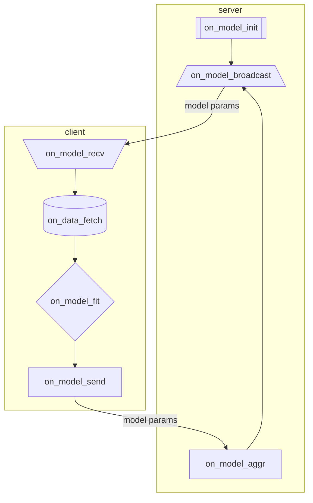

# FLoX Client-Server Logic

FLoX is designed to be a highly modular and customizable framework for serverless, FL processes. It is built on top of a general 7-step abstraction for FL processes grouped into server-side and client-side logical steps. FLoX considers two abstract classes, `FloxServerLogic` and `FloxClientLogic`, for wrapping/implementing the logic needed for the server-side and client-side, respectively. Each step is run on either the server (S) or the clients (C). All 7 steps are listed below with the respective function that corresponds with them:

1. **(S)** Model Initialization: `on_model_init`
2. **(S)** Model Sharing: `on_model_broadcast`
3. **(C)** Receiving Model: `on_model_recv`
4. **(C)** Data Fetching: `on_data_fetch`
5. **(C)** Local Model Training: `on_model_fit`
6. **(C)** Model Parameter Submission: `on_model_send`
7. **(S)** Model Aggregation: `on_model_aggr`

Below is a (`mermaid.js`) figure showing the sequence of the logic steps. Then, we further describe each of the logic steps.

## 1. Model Initialization
...

## 2. Model Sharing
...

## 3. Receiving Model 
...

## 4. Data Fetching
...

## 5. Local Model Training
...

## 6. Model Parameter Submission
...

## 7. Model Aggregation
...